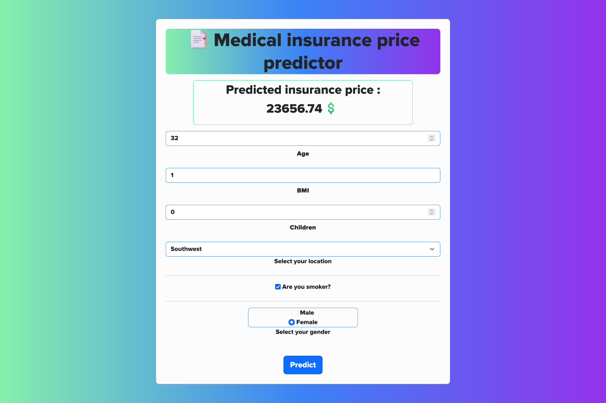

# Medical Insurance Costs

[](https://medical-insurance-price-prediction-qm5s.onrender.com/)

This regression project focuses on predicting medical insurance costs for individuals based on various factors such as age, BMI, smoking habits, and geographical location. 

## Dataset
https://www.kaggle.com/datasets/joebeachcapital/medical-insurance-costs


## Libraries
| Part                 | Libs                     | 
| -------------------- | ------------------------ |  
| Data Manipulation    | `pandas` `numpy`        |
| Data Visualization   | `matplotlib` `seaborn` |   
| Application          | `flask` `flask-wtf` |  


## Setting up a project

#### 1) Clone the repository
```
git clone https://github.com/VladHolobyn/medical-insurance-price-prediction.git 
cd medical-insurance-price-prediction
```

#### 2) Create an environment

Windows:
```
py -3 -m venv env
env\Scripts\activate
```
macOS/Linux:
```
python3 -m venv env
. env/bin/activate
```

#### 3) Install requirements
```
pip install -r requirements.txt
```

#### 4) Run application
```
py -m flask run
```

## Preview

